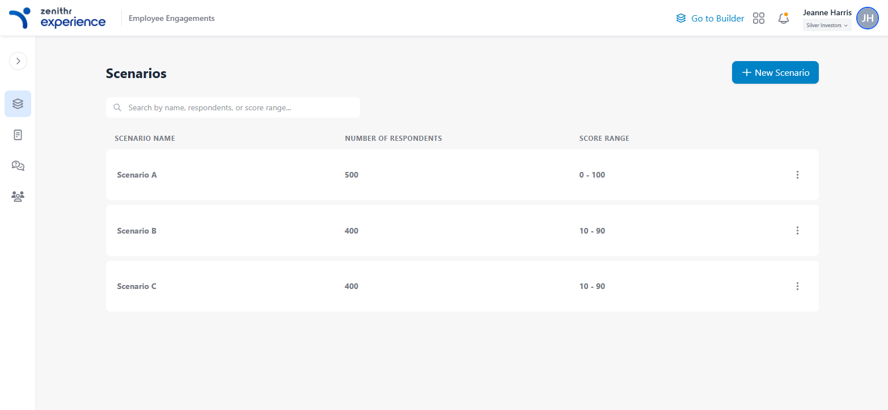

# Frontend Technical Assessment: Dynamic Stepper Component

## StepperApp

This project was generated using [Angular CLI](https://github.com/angular/angular-cli) version 20.2.1.
This project is a functional, full-screen dynamic stepper component built for an Angular application, as per the provided assessment requirements. It is designed to be highly reusable and configurable, with robust client-side validation and dynamic content injection.

---



## Table of Contents
- [Quick Start](#quick-start)
- [Architecture Overview](#architecture-overview)
- [Key Technical Decisions](#key-technical-decisions)
- [State Management & Data Persistence](#state-management--data-persistence)
- [Form Validation Architecture](#form-validation-architecture)
- [Dynamic Component Orchestration](#dynamic-component-orchestration)
- [UI/UX Design System](#uiux-design-system)
- [Testing Strategy](#testing-strategy)
- [Performance Considerations](#performance-considerations)
- [Deployment](#deployment)

## Quick Start

### Prerequisites
- Node.js (v18+ recommended)
- npm or yarn
- Angular CLI 20.2.1+

### Installation & Setup

1. **Install dependencies:**
   ```bash
   npm install
   ```

2. **Start development server:**
   ```bash
   npm start
   # or
   ng serve
   ```

3. **Access the application:**
   - Open `http://localhost:4200/` in your browser
   - Navigate to "New Scenario" to start the stepper workflow

4. **Run tests:**
   ```bash
   npm test
   ```

5. **Build for production:**
   ```bash
   npm run build
   ```

---

## Architecture Overview

### Core Architectural Principles

This application implements a **modern Angular standalone component architecture** with the following key principles:

1. **Micro-Frontend Ready**: Standalone components eliminate NgModule dependencies
2. **Domain-Driven Structure**: Clear separation between pages, shared components, and services
3. **Reactive State Management**: Centralized form state with reactive updates
4. **Progressive Enhancement**: Lazy-loaded routes and components for optimal performance

### Project Structure

```
src/app/
├── pages/                    # Feature pages (survey steps)
│   ├── scenarios/           # Landing page with survey scenarios
│   ├── select-product/      # Step 1: Product selection
│   ├── total-respondents/   # Step 2: Respondent configuration
│   ├── select-criteria/     # Step 3: Distribution criteria
│   ├── set-impact-drivers/  # Step 4: Impact drivers weighting
│   ├── enps/               # Step 5: eNPS configuration
│   └── comments/           # Step 6: Comments collection
├── shared/
│   ├── components/          # Reusable UI components
│   │   ├── dynamic-stepper/ # Main stepper orchestrator
│   │   └── paginator/       # Step navigation indicator
│   ├── guards/             # Route protection logic
│   ├── layouts/            # Application layouts
│   ├── models/             # Data models and interfaces
│   └── services/           # Business logic and state management
└── app.ts                  # Root application component
```

---

## Key Technical Decisions

### 1. State Management & Data Persistence

**Decision**: Centralized reactive form management with sessionStorage persistence

**Rationale**:
- **Single Source of Truth**: The `HelpersService` manages one main FormGroup containing all step forms
- **Persistence Strategy**: SessionStorage ensures data survives page refreshes but clears on tab close
- **Reactive Updates**: Form changes automatically trigger validation and persist to storage

**Implementation Details**:

```typescript
// Centralized form structure in HelpersService
readonly mainForm = this.createMainForm();

private createMainForm() {
  const form = this.fb.group({
    productDetailsForm: this.fb.group({ /* step 1 fields */ }),
    respondentsForm: this.fb.group({ /* step 2 fields */ }),
    distributionForm: this.fb.group({ /* step 3 fields */ }),
    impactDriversForm: this.fb.group({ /* step 4 fields */ }),
    enpsForm: this.fb.group({ /* step 5 fields */ }),
    commentsForm: this.fb.group({ /* step 6 fields */ })
  });

  // Auto-persist on changes
  form.valueChanges.subscribe(() => this.saveFormData(form));
  return form;
}
```

**Benefits**:
- Cross-step form validation
- Automatic data recovery
- Simplified component logic
- Consistent user experience

### 2. Form Validation Architecture

**Decision**: Multi-layered validation with custom validators and route guards

**Validation Layers**:

1. **Field-Level Validation**:
   ```typescript
   // Built-in validators
   title: ['', [Validators.required, Validators.minLength(3)]]
   totalRespondents: [undefined, [Validators.required, Validators.min(1)]]
   ```

2. **Cross-Field Validation**:
   ```typescript
   // Custom sum validator for percentage fields
   const sumValidator = (targetSum: number) => {
     return (control: AbstractControl): ValidationErrors | null => {
       const sum = Object.values(control.value)
         .reduce((total: number, current: any) => total + (+current || 0), 0);
       return sum === targetSum ? null : { totalNot100: { value: sum, required: targetSum } };
     };
   };
   ```

3. **Route-Level Validation**:
   ```typescript
   // Prevents navigation with invalid forms
   export const stepperFormGuard: CanActivateFn = (route: ActivatedRouteSnapshot) => {
     const formGroupName = route.data['formGroupName'];
     const formGroup = inject(HelpersService).mainForm.get(formGroupName);
     return formGroup?.valid || false;
   };
   ```

**Benefits**:
- Immediate user feedback
- Prevents invalid data submission
- Consistent validation rules
- Enhanced user experience

### 3. Dynamic Component Orchestration

**Decision**: Route-driven dynamic stepper with metadata-based navigation

**Implementation Strategy**:

```typescript
// Dynamic step generation from route configuration
getSurveyPaginatorData(parentPath: string): NavigatorData[] {
  const surveyChildRoutes = this.router.config
    .find((r: Route) => r.path === parentPath)?.children || [];

  return surveyChildRoutes
    .filter((child: Route) => child.path && child.loadComponent)
    .map((child: Route, idx: number) => ({
      page: this.formatPageName(child.path),
      path: `/${parentPath}/${child.path}`,
      required: true,
      valid: this.isStepValid(child.data?.formGroupName),
      current: location.pathname.includes(`/${parentPath}/${child.path}`)
    }));
}
```

**Key Features**:
- **Self-Configuring**: Steps automatically appear based on route configuration
- **Lazy Loading**: Components loaded on-demand for better performance
- **Metadata Driven**: Route data specifies validation requirements
- **Flexible Ordering**: Easy to reorder or add/remove steps

**Benefits**:
- Reduced maintenance overhead
- Consistent navigation behavior
- Easy to extend with new steps
- Performance optimized

---

## State Management & Data Persistence

### Persistence Strategy

The application implements a **hybrid persistence model**:

```typescript
// SessionStorage for form data persistence
private saveFormData(form: FormGroup): void {
  try {
    const rawData = form.getRawValue();
    sessionStorage.setItem('surveyFormData', JSON.stringify(rawData));
  } catch (e) {
    console.error('Failed to save form data', e);
  }
}

// Automatic data restoration on service initialization
private loadFormData(form: FormGroup): void {
  try {
    const savedData = sessionStorage.getItem('surveyFormData');
    if (savedData) {
      const parsedData = JSON.parse(savedData);
      form.patchValue(parsedData, { emitEvent: false });
    }
  } catch (e) {
    console.error('Failed to load form data', e);
  }
}
```

### Data Flow Architecture

```
┌─────────────────┐    ┌──────────────────┐    ┌─────────────────┐
│   Step Component │────│  HelpersService  │────│  SessionStorage │
│                 │    │   (mainForm)     │    │                 │
└─────────────────┘    └──────────────────┘    └─────────────────┘
         │                       │                       │
         │ Form Changes           │ Auto-persist          │
         ▼                       ▼                       ▼
┌─────────────────┐    ┌──────────────────┐    ┌─────────────────┐
│  Real-time      │    │  Cross-step      │    │  Browser        │
│  Validation     │    │  Validation      │    │  Refresh Safe   │
└─────────────────┘    └──────────────────┘    └─────────────────┘
```

**Benefits**:
- **Data Integrity**: Form state preserved across browser refreshes
- **User Experience**: No data loss during navigation
- **Performance**: Minimal memory footprint with sessionStorage
- **Privacy**: Data automatically cleared when tab closes

---

## Form Validation Architecture

### Custom Validator Patterns

The application implements several sophisticated validation patterns:

#### 1. Sum Validation for Percentage Fields

```typescript
// Generic sum validator for any target total
const sumValidator = (targetSum: number) => {
  return (control: AbstractControl): ValidationErrors | null => {
    if (!control || !control.value) return null;
    
    const sum = Object.values(control.value)
      .reduce((total: number, current: any) => total + (+current || 0), 0);
    
    return sum === targetSum ? null : { 
      totalNot100: { value: sum, required: targetSum } 
    };
  };
};

// Applied to impact drivers form
impactDriversForm: this.fb.group({
  I: [50, Validators.required],
  M: [10, Validators.required],
  P: [10, Validators.required],
  A: [11, Validators.required],
  C: [10, Validators.required],
  T: [10, Validators.required],
}, { validators: sumValidator(100) })
```

#### 2. Real-time Calculated Fields

```typescript
// eNPS component with live calculation
ngOnInit(): void {
  this.form.valueChanges.subscribe(values => {
    this.totalPercentage = this.getWeightageTotal(values);
    this.calculateOverallScore(values);
    this.formValid.emit(this.form.valid);
  });
}

calculateOverallScore(values: any): void {
  const { promoters, detractors } = values;
  this.overallScore = (promoters - detractors) || 0;
}
```

#### 3. Dynamic FormArray Validation

```typescript
// Select criteria with dynamic options
private createCriterion(name: string): FormGroup {
  return this.fb.group({
    name: [name],
    options: this.fb.array([], Validators.required)
  });
}

// Validation ensures at least one option per criterion
get selectedCriteria(): FormArray {
  return this.form.get('selectedCriteria') as FormArray;
}
```

### Route Guard Integration

```typescript
// Route configuration with validation requirements
{
  path: 'total-respondents',
  loadComponent: () => import('./pages/total-respondents/total-respondents.component')
    .then(m => m.TotalRespondentsComponent),
  canActivate: [stepperFormGuard],
  data: {
    formGroupName: 'productDetailsForm'  // Specifies which form must be valid
  }
}
```

---

## Dynamic Component Orchestration

### Route-Driven Architecture

The stepper system automatically generates navigation based on route configuration:

```typescript
// Dynamic step discovery
getSurveyPaginatorData(parentPath: string): NavigatorData[] {
  const surveyChildRoutes = this.router.config
    .find((r: Route) => r.path === parentPath)?.children || [];

  return surveyChildRoutes
    .filter((child: Route) => child.path && child.loadComponent)
    .map((child: Route, idx: number) => ({
      page: this.formatPageName(child.path),
      path: `/${parentPath}/${child.path}`,
      required: true,
      valid: this.isStepValid(child.data?.formGroupName),
      current: location.pathname.includes(`/${parentPath}/${child.path}`)
    }));
}
```

### Component Communication Pattern

```
┌─────────────────────────────────────────────────────────────┐
│                    DynamicStepperComponent                   │
│  ┌─────────────┐  ┌─────────────────┐  ┌─────────────────┐  │
│  │ Paginator   │  │  Router Outlet  │  │  Action Buttons │  │
│  │ Component   │  │   (Step Page)   │  │  (Next/Prev)    │  │
│  └─────────────┘  └─────────────────┘  └─────────────────┘  │
└─────────────────────────────────────────────────────────────┘
                              │
                              ▼
┌─────────────────────────────────────────────────────────────┐
│                      HelpersService                         │
│  • Centralized form management                              │
│  • Route navigation utilities                               │
│  • Persistence logic                                       │
└─────────────────────────────────────────────────────────────┘
```

### Benefits of This Architecture

1. **Scalability**: Easy to add new steps without modifying existing code
2. **Maintainability**: Single point of configuration for step order
3. **Testability**: Each step can be tested in isolation
4. **Performance**: Lazy loading reduces initial bundle size
5. **Flexibility**: Steps can be conditionally included based on business rules

---

## UI/UX Design System

### Tailwind CSS 4.1.13 Integration

The application uses a **custom design system** built on Tailwind CSS:

```scss
// Custom theme configuration in styles.scss
@theme {
  /* Primary Colors */
  --color-primary-zenithr: #0082C6;
  --color-primary-button-hover: #03A9F4;
  
  /* Secondary/Neutral Colors */
  --color-secondary-zenithr: #757985;
  --color-secondary-1000: #9297A0;
  
  /* Semantic Colors */
  --color-success-500: #10B981;
  --color-warning-500: #F59E0B;
  --color-danger-500: #EF4444;
  
  /* Background Colors */
  --color-bg: #f7f7f8;
}
```

### Component Design Patterns

#### 1. Consistent Form Styling
```html
<!-- Standardized input styling -->
<input type="number" formControlName="promoters"
       class="w-24 border rounded text-right p-2 focus:outline-none focus:border-blue-500">
```

#### 2. Interactive Feedback
```html
<!-- Dynamic validation styling -->
<span [ngClass]="{'text-red-500': totalPercentage !== 100}">{{ totalPercentage }}%</span>

<!-- Conditional error messages -->
@if (form.invalid && totalPercentage !== 100) {
  <p class="mt-2 text-red-500 text-sm text-center">
    The total must sum to 100%.
  </p>
}
```

#### 3. Progressive Enhancement
```html
<!-- Button states with hover effects -->
<button (click)="onNext()"
        class="flex items-center px-4 py-2 text-white font-medium bg-primary-zenithr hover:bg-primary-button-hover rounded-md shadow transition-colors duration-200">
```

### Responsive Design Approach

The application uses a **mobile-first responsive strategy**:
- Flexible layouts with Tailwind's responsive prefixes
- Touch-friendly button sizes (minimum 44px)
- Readable typography scales
- Optimized for both desktop and mobile workflows

---

## Testing Strategy

### Testing Architecture

The application is configured for comprehensive testing:

```json
// tsconfig.spec.json
{
  "extends": "./tsconfig.json",
  "compilerOptions": {
    "outDir": "./out-tsc/spec",
    "types": ["jasmine"]
  },
  "include": ["src/**/*.ts"]
}
```

### Recommended Testing Patterns

#### 1. Component Testing
```typescript
// Example: Testing form validation
describe('EnpsComponent', () => {
  it('should calculate correct eNPS score', () => {
    component.form.patchValue({
      promoters: 60,
      passives: 15,
      detractors: 25
    });
    
    expect(component.overallScore).toBe(35); // 60 - 25 = 35
  });
});
```

#### 2. Service Testing
```typescript
// Example: Testing form persistence
describe('HelpersService', () => {
  it('should save and restore form data', () => {
    const testData = { productDetailsForm: { title: 'Test' } };
    service.mainForm.patchValue(testData);
    
    expect(sessionStorage.getItem('surveyFormData')).toBeTruthy();
  });
});
```

#### 3. Route Guard Testing
```typescript
// Example: Testing navigation guards
describe('stepperFormGuard', () => {
  it('should allow navigation when form is valid', () => {
    spyOn(service.mainForm, 'get').and.returnValue({ valid: true });
    
    const result = stepperFormGuard(mockRoute);
    
    expect(result).toBe(true);
  });
});
```

---

## Performance Considerations

### Optimization Strategies

1. **Lazy Loading**: All page components are lazy-loaded
   ```typescript
   {
     path: 'select-product',
     loadComponent: () => import('./pages/select-product/select-product.component')
       .then(m => m.SelectProductComponent)
   }
   ```

2. **OnPush Change Detection**: Planned for high-frequency components
   ```typescript
   @Component({
     changeDetection: ChangeDetectionStrategy.OnPush
   })
   ```

3. **Signals for State Management**: Modern state primitives
   ```typescript
   drivers = signal(this.driversData);
   selectedDriver = signal<string>(this.controlKeys.at(0) || '');
   ```

4. **Bundle Size Optimization**:
   - Tree-shaking enabled
   - Standalone components reduce bundle size
   - Lazy-loaded routes split the bundle

### Bundle Analysis

```bash
# Analyze bundle size
ng build --stats-json
npx webpack-bundle-analyzer dist/stepper-app/stats.json
```

---

## Deployment

### Production Build

```bash
# Standard production build
npm run build

# GitHub Pages deployment
npm run host  # Builds and commits to docs directory
```

### Configuration

```json
// angular.json - Production configuration
"production": {
  "budgets": [
    {
      "type": "initial",
      "maximumWarning": "500kB",
      "maximumError": "1MB"
    },
    {
      "type": "anyComponentStyle",
      "maximumWarning": "4kB",
      "maximumError": "8kB"
    }
  ],
  "outputHashing": "all"
}
```

### Environment Setup

1. **Development**: `ng serve` (port 4200)
2. **Production**: `ng build --configuration production`
3. **Testing**: `ng test` (Karma + Jasmine)

---

## Design Choices Summary

### Why These Architectural Decisions?

1. **Standalone Components**: Future-proof architecture, reduced complexity
2. **Centralized State Management**: Simplified cross-step validation and data flow
3. **SessionStorage Persistence**: Balance between UX and privacy
4. **Route-Driven Navigation**: Maintainable and flexible step management
5. **Custom Validators**: Business-specific validation logic
6. **Tailwind CSS**: Rapid prototyping with consistent design system

These decisions prioritize **maintainability**, **user experience**, and **developer productivity** while keeping the codebase scalable for enterprise applications.
